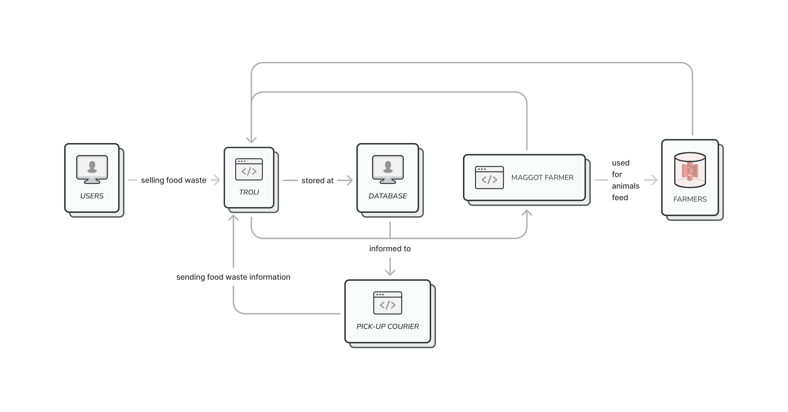

# Troli for Google Solution Challenge 2023

Troli is a digital application that aims to realize the 15th point in the Sustainable Development Goals, namely "Life on Land' and the 12th point, namely "Responsible Consumption and Production". food for farms that have been acquired by Troli. Troli acquires maggot breeders and other animal breeders, such as catfish, poultry, cattle, and goats. Food waste that has been submitted to Troli will be processed as animal feed for the acquired farms. In addition, Troli also based on e-commerce that sells the clothing needs of livestock acquired by Troli, such as meat, milk, etc. Troli rely on gamification to attract attention and appreciate users who contribute to the submission of food waste.

## System Architecture

